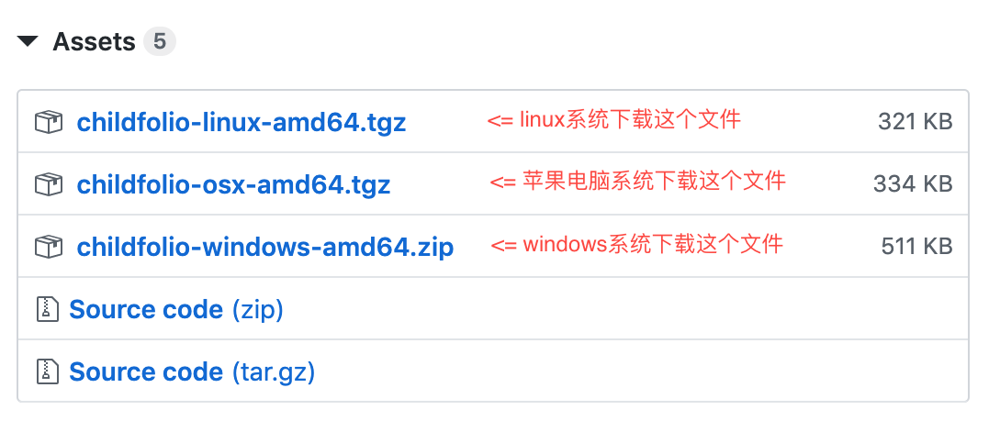

# “时光迹”备份程序

孩子幼儿园开始使用“[时光迹](https://apps.apple.com/cn/app/%E6%97%B6%E5%85%89%E8%BF%B9-%E5%AE%B6%E5%BA%AD%E7%89%88/id1133864354)”来记录孩子的成长，能经常看到孩子的情况与老师的评语，作为家长非常开心。
但美中不足的是，时光迹App中的文字不能拷贝，也没有数据导出功能。
出于对孩子照片管理等需要，我编写了这个程序。

## 使用
请在[下载页面](https://github.com/xyb/childfolio-backup/releases)按照自己的电脑系统选择文件。

保存到电脑上、并解压缩之后，双击 childfolio 文件运行，输入账号和密码，稍等片刻，备份完成之后会在浏览器中打开一个查看的页面。

## 关于 Bug
因为我只在苹果和 linux 系统里测试过，windows 版本可能会遇到问题，还请多担待一下。
如果有时间，请在 [issues](https://github.com/xyb/childfolio-backup/issues) 页面描述一下出了什么问题，这可以帮助我完善这个程序。
感谢！
